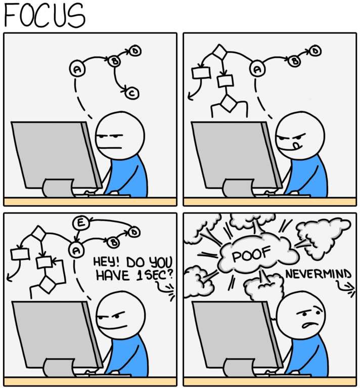

# La fabrique numérique des ministères sociaux

[Site Public Officiel: www.fabrique.social.gouv.fr](https://www.fabrique.social.gouv.fr/)

## Espace freestyle des développeurs

### Ressources:
- [SocialGouv SRE documentation](https://socialgouv.github.io/support/)

### Lecture:
- [The XY Problem](https://xyproblem.info)
- [Don't ask to ask, just ask](https://dontasktoask.com/)

### Humour:
- 